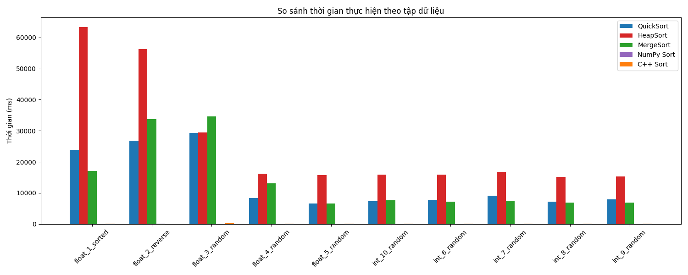
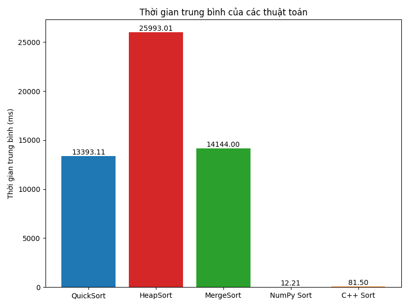

# Benchmark Các Thuật Toán Sắp Xếp 

## 1. Giới thiệu

Project này thực hiện benchmark và so sánh hiệu năng giữa các thuật toán sắp xếp được cài đặt bằng:

- Python thuần (tự cài đặt)
- NumPy (`np.sort`)
- C++ (`std::sort`)

Mục tiêu là đánh giá hiệu năng thực tế trên dữ liệu lớn và so sánh sự khác biệt giữa các cách tiếp cận khác nhau.

---

## 2. Mục tiêu

So sánh thời gian thực thi của:

- QuickSort (Python)
- MergeSort (Python)
- HeapSort (Python)
- NumPy `np.sort`
- C++ `std::sort`

Kích thước dữ liệu: **1.000.000 phần tử** cho mỗi dataset.

---

## 3. Mô tả dữ liệu

### Float
- Sorted
- Reverse
- Random (3 tập)

### Int
- Random (5 tập)

Tất cả dữ liệu được sinh tự động và lưu trong thư mục `data/`.

---

## 4. Cấu trúc thư mục

```
Sorting_Algorithms_DSA/
│
├── data/
├── python/
│   ├── sorting_algorithms.py
│   ├── generate_data.py
│   ├── benchmark.py
│   └── visualize.py
│
├── cpp/
│   └── sorting_func_cpp.cpp
│
├── results/
│   ├── benchmark_results.csv
│   ├── comparison_by_dataset.png
│   └── average_comparison.png
│
└── README.md
```

---

## 5. Hướng dẫn chạy

### Cài đặt

```bash
pip install numpy matplotlib
```

### Biên dịch C++

```bash
cd cpp
g++ sorting_func_cpp.cpp -O2 -o sorting_func_cpp
```

### Sinh dữ liệu

```bash
cd python
python generate_data.py
```

### Chạy benchmark

```bash
python benchmark.py
```

### Vẽ biểu đồ

```bash
python visualize.py
```

---

## 6. Kết quả thực nghiệm

### 6.1 So sánh theo từng dataset



---

### 6.2 So sánh thời gian trung bình



---

### 6.3 Kết quả trung bình (ms)

| Thuật toán | Thời gian trung bình (ms) |
|------------|--------------------------|
| MergeSort  | 14143.99 |
| QuickSort  | 13393.11 |
| HeapSort   | 25993.01 |
| NumPy Sort | 12.21 |
| C++ Sort   | 81.50 |

---

## 7. Phân tích kết quả

### 7.1 So sánh tổng quan

- NumPy Sort có thời gian thực thi thấp nhất trong toàn bộ benchmark.
- C++ `std::sort` nhanh hơn đáng kể so với các cài đặt Python thuần.
- QuickSort là thuật toán nhanh nhất trong nhóm Python.
- HeapSort có thời gian thực thi lớn nhất.

---

### 7.2 So sánh trong nhóm Python

Thứ tự hiệu năng trung bình:

```
QuickSort < MergeSort << HeapSort
```

QuickSort và MergeSort có hiệu năng tương đối gần nhau.  
HeapSort có thời gian thực thi cao hơn rõ rệt so với hai thuật toán còn lại.

---

### 7.3 So sánh giữa thư viện tối ưu và cài đặt thủ công

- NumPy Sort vượt trội hoàn toàn về thời gian thực thi.
- C++ `std::sort` nhanh hơn đáng kể so với Python thuần.
- Sự khác biệt thể hiện rõ khi xử lý dữ liệu kích thước lớn (1 triệu phần tử).

---

## 8. Nhận xét

- Các thư viện chuẩn cho hiệu năng vượt trội so với cài đặt thủ công.
- Các thuật toán có cùng độ phức tạp lý thuyết vẫn cho kết quả thực nghiệm khác nhau.
- Khi kích thước dữ liệu lớn, chênh lệch hiệu năng trở nên rất rõ ràng.

---

## 9. Kết luận

1. NumPy là lựa chọn hiệu quả nhất trong môi trường Python.
2. C++ `std::sort` cho hiệu năng cao và ổn định.
3. QuickSort là thuật toán hiệu quả nhất trong nhóm Python tự cài đặt.
4. HeapSort có hiệu năng thấp nhất trong thực nghiệm.
5. Trong ứng dụng thực tế nên ưu tiên sử dụng thư viện tối ưu.

